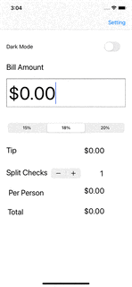

# CodePath-iOS - TipCalculator

This is a Tip Calculator application for iOS submitted as the [pre-work](https://github.com/ebbuni1023/CodePath-iOS) requirement for CodePath.

Time spent: 9 hours

**Description**

This is a simple app that can calculate the tip.
User can open the app, type an amount, choose the tip percentage from the tip control.
Also, user can split the total amount by each person.

**Completed:**

* [x] Required: User can enter a bill amount, choose a tip percentage, and see the tip and total values.
* [x] Required: Settings page to change the default tip percentage.
* [x] Optional: Dark Mode is enabled
* [ ] Optional: UI animations (will do)

